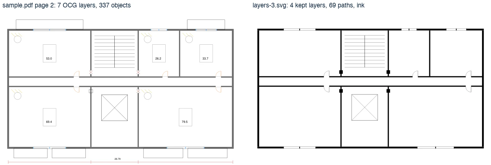
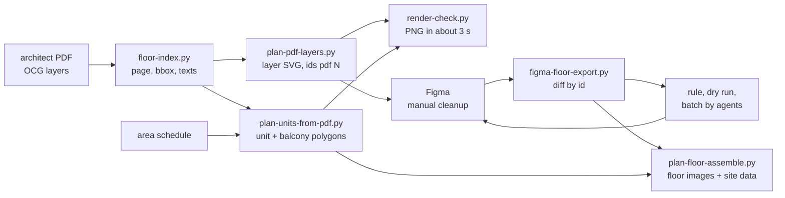
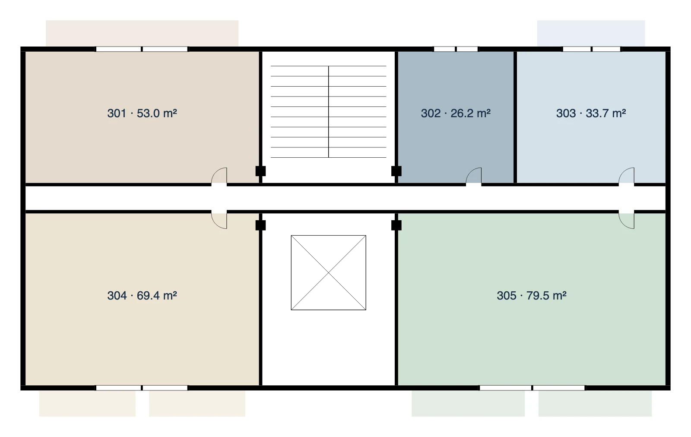
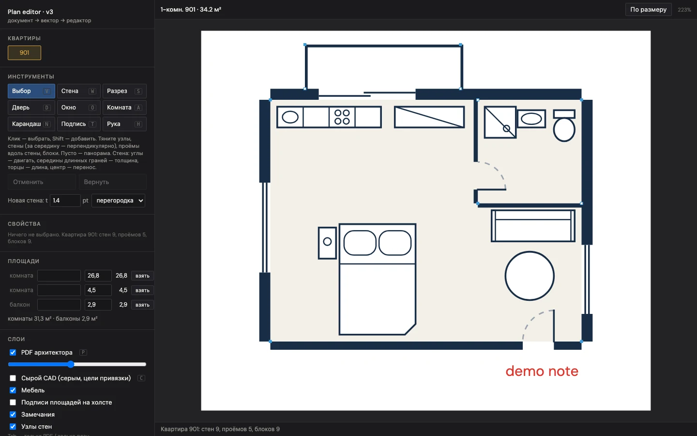

# floorplan-pipeline

Turns an architect's multi-page PDF into clean vector floor and apartment plans by reading the PDF's own OCG layers.

History: this is a public snapshot of a private repository (48 commits, 2 to 27 Sep 2026). Client details are replaced.

It is for teams that sell or present apartments and get the drawings as a CAD export, not as clean plans. It extracts walls, openings and core by layer, takes unit and balcony polygons from the architect's area layer, checks them against the official area schedule, and hands the drawing to Figma for a manual pass whose edits come back as a diff by object id.





## Key decisions

- **Layers, not colors.** The first version classified PDF vectors by color for two weeks. The PDF had OCG layers all along. Filtering by layer cut a floor from 39k objects to 1.9k and removed every color heuristic. Layer rules live in a config file (`config/layers.example.json` holds the 13 layers kept on the real project, with Georgian layer names from the CAD export).
- **Polygons from the source, no fitting.** Apartment and balcony outlines come from the architect's area layer, drawn as single segments and chained into loops. On the real project: a 114 page PDF, 279 apartments on 25 floors, 349 balcony polygons, every area within 0.05 m2 of the official schedule. When two loops fit one unit equally, the tool reports and does not guess.
- **Diff by object id.** Every exported path carries `id="pdf <seqno>"`, and the id survives a round trip through Figma. A manual cleanup of one floor becomes a list of deleted, moved and recolored objects per layer, and that list becomes a batch rule with a dry run.
- **A run is a picture.** Every output is rendered with headless Chromium (Playwright) in about 3 s and looked at before it goes to Figma or the site.
- **Agents by instruction file.** Mechanical work goes to smaller models with one instruction file per action (`agents/`). Five Sonnet agents with five floors each closed 25 floors in about 2 minutes and returned counters with expected ranges.
- **Snapshots at every stage.** A git commit per step, a Figma page clone before every batch, a server snapshot before every deploy. A page clone once restored 156 stair nodes after a bad rule.
- **Strict plan classes.** Units that match by translation and mirroring share one drawing: 95 strict classes (33 base plans and 62 derived) cover all 279 apartments.

The method is written up in [docs/harness.md](docs/harness.md). The floor assembly contract (ownership cells, layer order, self checks) is in [docs/floor-contract.md](docs/floor-contract.md).

## Repository

```
tools/            35 files: 29 Python scripts from the real project (about 17k lines), 2 Node scripts, 4 new
  fpconfig.py       new: config loader, every script resolves paths through it (fpconfig.mjs for Node)
  floor-index.py    new: page, bbox and texts per floor from the layers
  render-check.py   new: SVG to PNG with Playwright, unit overlay, blank check
  plan-*.mjs        plan documents to SVG and to Figma primitives (Node)
config/           project config, layer rules (example from the real project, sample), render style
sample/           synthetic PDF generator and a simulated Figma edit
tests/            end-to-end test on the sample, unit tests for room areas
editor/           web plan editor (v3 documents), renderer, symbols, demo plan
studio/           web style studio for floor clusters, runs on a demo floor
figma/            use_figma scripts (Figma Plugin API)
agents/           AGENT-*.md instruction templates
docs/             harness.md, floor-contract.md, images
```

The original project had about 19k lines of Python across 45 scripts. Scripts for site capture, deployment and design research are not part of this repository.

## Run it

Requirements: [uv](https://docs.astral.sh/uv/), Node 18 or newer (for the plan renderer), macOS or Linux.

```bash
uv sync
uv run playwright install chromium
make sample     # synthetic PDF -> floor files -> layer SVG -> unit polygons -> render check -> diff by id
make test       # 18 tests
make editor     # http://127.0.0.1:8765/editor/app/ and http://127.0.0.1:8765/studio/
make editor PORT=8766    # if 8765 is taken
```

`make editor` serves static files only. Editing works in the browser; saving to the server needs `tools/plan-api.py`, which opens a project PDF on start. Without project data the editor has no PDF underlay and the studio runs on its demo floor.

`make sample` writes everything to `sample/work/`. What to look at: `sample/work/plan-studio/v3/figma/floor-3-check.png`.



On your own PDF:

```bash
cp config/project.example.json config/project.json    # set pdf, pages, layers, schedule
uv run tools/plan-pdf-layers.py 2 --inventory         # layer names and counts on the page of floor 2: fill the layer config from this
uv run tools/floor-index.py                           # page, bbox and texts per floor, from the configured layers
uv run tools/plan-pdf-layers.py 2 3 4                 # layer SVG per floor
uv run tools/plan-units-from-pdf.py --all --dry       # unit polygons against the schedule, nothing written
uv run tools/plan-units-from-pdf.py --all             # write the polygons once the dry table is clean
uv run tools/render-check.py 2 --units
```

The schedule is a JSON file `{"units": [{"number", "floor", "type", "living", "balcony", "total"}]}`.

## What runs on the sample, what needs project data

| Part | Sample | Needs |
|---|---|---|
| `floor-index`, `plan-pdf-layers`, `plan-units-from-pdf`, `render-check` | runs, tested | a PDF with OCG layers, a schedule |
| `figma-floor-export` (clean export, diff by id) | runs, tested | a Figma SVG export of the floor frame |
| `plan-build.mjs`, `plan-figma.mjs`, `plan-png`, `editor/`, `studio/` | runs on the demo plan and demo floor | plan documents (`editor/SCHEMA.md`) |
| `plan-room-areas` | unit tests on a synthetic unit | room geometry exported from Figma |
| `floor-gap-check` (slivers, gaps and loose pieces in walls) | runs on the demo unit render (commands below) | any PNG render in the plan ink color |
| `plan-floor-assemble`, `render-plans` | no | unit finals exported from Figma, coverage classes, clustered floor JSON |
| `extract-plans`, `export-plan-vectors`, `trace-plans`, `plan-import`, `plan-api` | no | an ArchiCAD PDF with clip paths per unit (first-generation extractor, color clusters) |
| `plan-coverage-*`, `plan-pdfvec`, `plan-wallthin`, `plan-room-labels-data`, `truth-compare`, `floor-sidebyside`, `balcony-check`, `unit-*`, `build-type-sheet`, `site-version`, `plan-cleanup` | no | plan documents, site assets or one-off data of the real project |

Gap check on the demo unit, after `make sample`:

```bash
FLOORPLAN_CONFIG=config/sample.json uv run tools/render-check.py --svg sample/work/plan-out/unit-901.svg
FLOORPLAN_CONFIG=config/sample.json uv run tools/floor-gap-check.py sample/work/plan-out/unit-901.png --out sample/work/gaps
```

It reports 2 slivers, the two sofa arms: furniture false positives, a known case listed in the script's docstring.

The big scripts are kept as they ran; trimming them would break them. Their paths go through `fpconfig.py`, so they run against any workspace with the same layout.

Code comments, console output of the older scripts, the editor and studio UIs, and `editor/SCHEMA.md` are in Russian: they are working artifacts of the original project.



## Status

Extracted from a finished client project (September 2026). No client drawings or data files are included: the sample PDF, the demo floor and the demo apartment are synthetic. Counts in the text and the layer names in `config/layers.example.json` come from the real project, and the one-off Figma scripts and `layout_1005` in `unit-plan-v2.py` keep the coordinates of the one unit each was written for. The layer path (index, layers, units, render check, diff) is tested on the sample; the assembler and the first-generation tracer need the data listed above.

## License

MIT, see [LICENSE](LICENSE).
